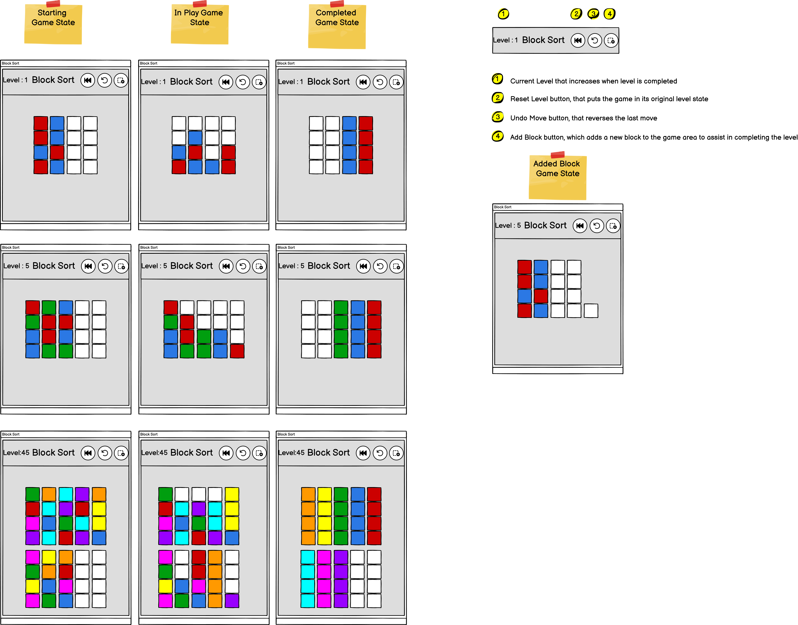
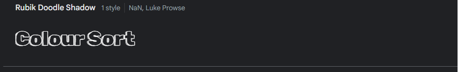
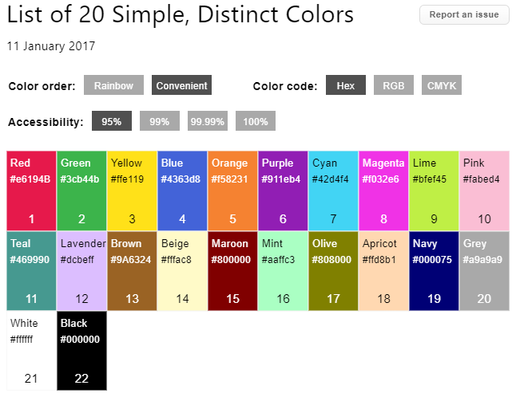

# COLOUR SORT

Colour Sort is a single player endless sorting game. It has increasingly difficult game levels to keep the player engaged and coming back for more. The aim of the game is to sort the shuffled stacks of blocks in to stacks of the same colour, which triggers a new game to start and increases the level.

The website can be viewed [here](https://davep33l.github.io/colour-sort/).


## Scope

### User Stories/Goals

1. As a user of the game I want to be able to play an endless game of a colour sorting puzzle.
2. As a user of the game I want to be able to make the levels less difficult during game play. 

## Skeleton

### Wire-frames



## Surface

### Typography

I wanted a playful font for the main logo title, one that was quite "blocky" to support the theme of "sorting blocks".

The font chosen for this was from google-fonts as per below.

1. [Rubik Doodle Shadow](https://fonts.google.com/specimen/Rubik+Doodle+Shadow)



### Colours

In the interest of accessibility for users/players who may have problems with distinguishing colours. I sourced a list of colours from [here](https://sashamaps.net/docs/resources/20-colors/), where the author has performed some research and testing on the best colour combinations.

For the game I selected the colours in which I felt were also pleasing to the eye and bold and bright enough for the game.



### Images

| Image Purpose | Type | Author | Source | Additional info |
| ------------- | ---- | ------ | ------ | --------------- |
|  Favicon      | Favicon |  Dave Peel  | Developer created       |    |
|  Reset button      | [Image](https://icons8.com/icon/8zeVPal82HDB/synchronize) |  [icons8.com ](https://icons8.com/) | [icons8.com ](https://icons8.com/)       | The base icon was edited within icon8.com by Dave Peel (the developer)   |
|  Undo button      | [Image](https://icons8.com/icon/9WPPIgWX5Ofo/replay) |  [icons8.com ](https://icons8.com/) | [icons8.com ](https://icons8.com/)       | The base icon was edited within icon8.com by Dave Peel (the developer)   |
|  Add Block button      | [Image](https://icons8.com/icon/XSY9YrzlXLkZ/add-new) |  [icons8.com ](https://icons8.com/) | [icons8.com ](https://icons8.com/)       | The base icon was edited within icon8.com by Dave Peel (the developer)   |
|  How Quest button      | [Image](https://icons8.com/icon/Br3GRUwEPAGI/how-quest) |  [icons8.com ](https://icons8.com/) | [icons8.com ](https://icons8.com/)       | The base icon was edited within icon8.com by Dave Peel (the developer)   |


## Features

See Testing for demonstration of the features

- Auto randomising of coloured blocks to initiate a new level/game
- Game logic to prevent incorrect moves
- Ability to undo the previous move
- Ability to reset the current level
- Ability to add up to 2 supporting blocks to assist with level completion
- Automatic level saving
- Saves state of colours if you close browser and return
- Animated Game Title
- Informative How to Play section (with gifs of gameplay)
- Endless gameplay

## Future features

- An accessibility mode, where the user can turn on numbers as overlay to the colours to help identify the correct blocks if colour blind
- Database storage for players, for a leaderboard, level storage and start game colour formation (instead of localStorage)
- Special Level, where all colours are hidden, except for the top row, and they reveal as you move a block
- Advertisements for using "Add block", "Reset" and "Undo"

## Deployment

### Github Pages

This project was deployed to Github Pages using the following process:

1. Log in to Github
2. Ensure the relevant Github repository is selected
3. Navigate to the settings on the ribbon navigation bar
4. Ensure that the repository is set to public. This setting is at the bottom of the page in the "Danger Zone" section
5. Navigate to the pages section on the left navigation bar
6. Under Build and Deployment ensure the source is set to "deploy from branch"
7. Select "main" under the branch section and folder as "/root" and select save
8. Navigate to Actions on the ribbon navigation bar
9. There will be a "pages build and deployment" with a green tick if successful
10. Select this workflow action and there will be a link under the deploy aspect of the workflow
11. Select the link to view the site
12. The link for this site is https://davep33l.github.io/colour-sort/


## Technologies Used

### Languages Used

This game was created using HTML, CSS and vanilla Javascript.

### Frameworks, Libraries and Software Used

| What                                                 | Type             | Category        | Purpose                                                                                                                                                                                                    |
| ---------------------------------------------------- | ---------------- | --------------- | ---------------------------------------------------------------------------------------------------------------------------------------------------------------------------------------------------------- |
| [Balsamiq](https://balsamiq.com/wireframes/desktop/) | Desktop Software | Wireframe       | This was used to create the wireframe for this project                                                                                                                                                     |
| [Git](https://git-scm.com/)                          | Desktop Software | Version Control | This was used as version control from the terminal inside VS Code and was pushed to a remote repository hosted by github.com                                                                               |
| [Github](https://github.com/)                        | Online Software  | Version Control | This was used to store the code used for the website and to host the website using github pages                                                                                                            |
| [VS Code](https://code.visualstudio.com/)            | Desktop Software | Development     | This was the application used to develop the website. I used some extensions to assist with the development. Those being: **_Live Server, Code Spell Checker, Markdown Preview Github Styling, Git Graph_** |
| [Canva](https://www.canva.com/)            | Online Software | Development     | This application was used to design the Favicon png file (which was uploaded to favicon.io to generate the favicons). It was also used as a whiteboarding tool to help with visualisations for game state whilst developing |
| [favicon.io](https://favicon.io/)            | Online Software | Development     | This application was used to generate the favicons for the website, based on the png I designed in Canva |
| [Screentogif](https://www.screentogif.com/)            | Desktop Software | Development     | This application was used to generate the gifs for the how to play section |
| [Google Chrome](https://www.google.com/intl/en_uk/chrome/)            | Online Software | Development     | This application was used as the browser of choice for development. Utilising the Devtools throughout the development cycle |
|[ui.dev/amiresponsive](https://ui.dev/amiresponsive)|Online Software| Misc| This was used to create the responsive image for the top of the readme|


## Testing

Please see the [TESTING.md](/testing/TESTING.md) file for detailed test results.


## Credits

### Code

#### Code Ack 1

I required a solution to locate the relevant stack within the gameStacks based on the result from the click event. 

I found a solution on [this](https://www.tutorialrepublic.com/faq/how-to-find-an-object-by-property-value-in-an-array-of-javascript-objects.php) website

The piece of information that was useful was the use of the find method, which I utilised on this line of code.

`let obj = this.gameStacks.stacks.find(item => item.stackId === stackId);`

#### Code Ack 2

I needed a way of clearing the gameStacks from the DOM (so they could be drawn again) and found the solution [here](https://www.w3schools.com/jsref/met_node_removechild.asp)

Utilising it in my code as below.

```
    clearGameStacks() {
        while (this.domStackSection.hasChildNodes()) {
            this.domStackSection.removeChild(this.domStackSection.firstChild);
        }
    }
```

#### Code Ack 3

In order to display an animated game title, I wanted to add a delay to each colour change of the title. I found a solution [here](https://www.tutorialspoint.com/how-to-add-delay-in-a-loop-in-javascript), where I used the async/await functionality to allow the method to fully run. 

```
    async giveTitleRandomColour() {

        for (let i = 0; i < this.heading.children.length; i++) {
            let randomNumber = Math.floor(Math.random() * (this.colours.length));
            this.heading.children[i].className = this.colours[randomNumber];
            await sleep(75);
        }


        function sleep(ms) {

            if (typeof ms != "number") {
                throw new Error(`Incorrect data type. Needs to be a number. You passed in a ${typeof ms} of "${ms}" for ms`);
            }

            return new Promise(resolve => setTimeout(resolve, ms));
        }
    }
```

#### Code Ack 4

My mentor suggested that I amend my initial implementation of the starting of the game to the below. So the global scope is not cluttered. 

`window.onload = new GameManager().startGame();`

### Acknowledgements

To help maintain consistency with my git commits, I have utilised a local template highlighted in [this](https://blog.ossph.org/how-to-write-a-good-git-commit-message/#setting-up-a-commit-message-template) article.

In the interest of accessibility, I searched for colours that were unique enough, but maintained a enough contrast/difference to be distinguishable. This lead me to [this](https://sashamaps.net/docs/resources/20-colors/) website with a great resource of colours trying to solve a similar problem but for subway map lines. I selected a list of colours from this which I deemed appropriate for the game.

I would like to acknowledge my mentor, to whom I enjoy working with and sharing my ideas. The advice and encouragement provided is greatly appreciated. 

MDN was used heavily for this project, mainly for the Array.prototype methods. As understanding these allowed for a refactor of many loops within my code to use the prebuilt methods such as `map()`, `every()`, `findIndex()`. It was also used to understand the class creation and the syntax. 

[This](http://source-code-wordle.de/) website game me some inspriation on chosing class/variable names. 

## Additional Notes

I went through a full refactor of my code into more granular classes half way through the project. In order to improve the readability and maintainability. 

The main reasons for this was that I wanted to separate the state management of the gameStacks to its own object and not co-mingle the DOM updates and the gameStack state updates. 

By creating a new class GameStacks, I was able to separate these concerns and actually simplify some of the methods, like the comparing of the block colours and the moving of the blocks to change the gameStacks state. Giving more flexibility with the DOM related functions to be reused when they are given a gameStacks object. 

During this time, I also determined that my inital solution for the Stack state could be condensed. The map(), every() and findIndex() functions essentially replaced a lot of the initial looping code I had wrote. And with the use of these functions I decided to update the state of all the stacks at once each time a click event happened. This allowed for a major reduction in the code and should improve readability. 
