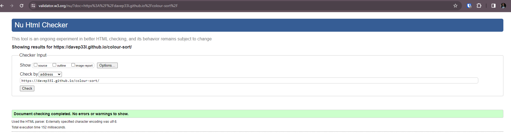

# Testing

### HTML Validator Testing

HTML was tested using the [W3C HTML Validator](https://validator.w3.org/)

|Page|Screenshot|
|---|---|
|index.html||

### CSS Validator Testing

CSS was tested using Jigsaw, the [W3C CSS Validator](https://jigsaw.w3.org/css-validator/)

|Page|Screenshot|
|---|---|
|index.html||

### Lighthouse Testing

|Page|Device|Screenshot|
|---|---|---|
|index.html|Desktop||
|index.html|Mobile||

### Jshint Testing

Passed

### WAVE (Web Accessibility Evaluation Tool) Testing

|Page|Result|
|---|---|
|index.html|

### Manual Testing

|Feature|Evidence|
|-|-|
|Adding Block||
|Browser Reset maintains level and colours||
|Cannot move to a filled stack||
|Completing a level||
|Different colours cannot move||
|How to play modal||
|Not able to click empty stack first||
|Reset functionality||
|Same colours can move||
|Unable to set same stack for first and second click||
|Undo functionality||

## User Stories Testing

- The game is endless as it will reach a maximum of 12 stacks once the game hits 80, then continue to increase in level maintaining the maximum stack amount. 
- The add block, undo and reset functionality allow for a user to make the level they are on easier by providing supporting blocks, or temporarily undoing a move / or resetting. 

